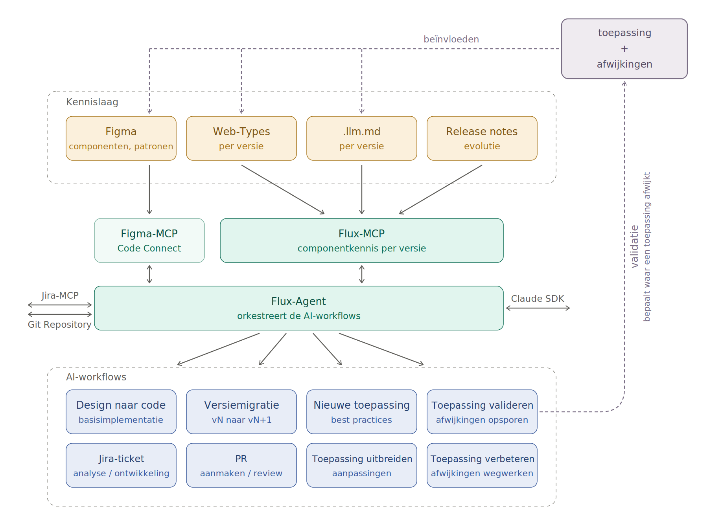

# AI-strategie: beschrijving bij het technische schema

## Kennislaag

Vier bronnen voeden de AI-ondersteuning, elk geversioneerd:

- **Figma** - componenten en patronen; het ontwerp zoals het bedoeld is.
- **Web-Types** - de component-API per versie.
- **.llm.md** - per versie een machineleesbare beschrijving gericht op AI-gebruik.
- **Release notes** - de evolutie tussen versies.

Deze bronnen zijn niet inwisselbaar: Figma voedt uitsluitend de Figma-MCP, de andere drie voeden samen de Flux-MCP.

## Ontsluitingslaag: twee MCP-servers en een agent

De ontsluiting bestaat uit drie componenten in plaats van 1:

- **Figma-MCP** met Code Connect ontsluit het design. Dit is bewust lichter weergegeven: het is geen eigen ontwikkeling maar bestaande tooling die we inzetten.
- **Flux-MCP** ontsluit de componentkennis per versie en is wel eigen bouwwerk.
- **Flux-Agent** orkestreert de AI-workflows. De agent is de client: hij initieert de bevragingen, de MCP-servers antwoorden - vandaar de dubbele pijlen.

De agent staat daarnaast in verbinding met **Jira-MCP** (tickets), de **Git Repository** (code) en de **Claude SDK** (het model). Dat maakt zichtbaar dat de agent niet enkel kennis raadpleegt, maar ook in de bestaande ontwikkelketen ingrijpt.

## AI-workflows

De agent stuurt 8 workflows aan. In het schema staan ze in 2 rijen van 4. De kolommen suggereren een verband, en dat is er ook, maar het is geen 1-op-1-koppeling. De echte indeling is: 6 inhoudelijke workflows die aan een toepassing werken, en 2 procesworkflows - Jira-ticket en PR - die elke inhoudelijke workflow omkaderen.

| Groep | Workflows | Verband |
|---|---|---|
| Bouwen | Design naar code (basisimplementatie), Nieuwe toepassing (best practices), Toepassing uitbreiden (aanpassingen) | Hetzelfde recept vanuit design en best practices. Design naar code is de bouwsteen van de andere 2. |
| Onderhouden | Versiemigratie (vN naar vN+1) | Staat op zichzelf: geen design, geen functionele wijziging, getriggerd door de release-cadans. |
| Terugkoppellus | Toepassing valideren (afwijkingen opsporen) → Toepassing verbeteren (afwijkingen wegwerken) | Een strikte sequentie: eerst opsporen, dan - na afstemming - wegwerken. Het enige paar dat echt 1-op-1 samenhoort. |
| Proces | Jira-ticket (analyse / ontwikkeling), PR (aanmaken / review) | Dwarsdoorsnijdend: elk inhoudelijk werk start in een ticket en eindigt in een PR. Hoort bij alle inhoudelijke workflows, niet bij 1 kolom. |

Een typische doorloop is dus: ticket → analyse → inhoudelijke workflow → PR → review. Enkel 'toepassing valideren' wijkt af: dat levert een rapport en tickets op, geen PR. Zo is er nooit losse AI-output: alles landt in de bestaande ontwikkelketen.

## De terugkoppellus

Rechtsboven staat de **toepassing met haar afwijkingen**: het resultaat zoals het in werkelijkheid is, niet zoals de norm het voorschrijft. 2 bewegingen verbinden dat met de rest:

- **Validatie** - de workflow "Toepassing valideren" bepaalt waar een toepassing afwijkt van de norm.
- **Beïnvloeden** - die vaststellingen werken terug op Figma, Web-Types en .llm.md.

Dat is de kern van de nieuwe strategie: de norm staat niet vast, maar groeit mee met wat de praktijk oplevert. Wat in een toepassing beter blijkt, wordt opgenomen in de kennisbronnen en is daarmee het vertrekpunt voor de volgende toepassing.

## Aandachtspunt bij het aanpassen van de analyse

Dit schema kent het begrip **modeltoepassing** niet meer. In de bestaande analyse is dat nog een centraal concept met een eigen sectie en een A/B-opsplitsing, en stonden modeltoepassingen als vierde bron in de kennislaag.

Hier is die rol overgenomen door de validatielus: de toepassing zelf is de bron van verbetering geworden, niet een aparte voorbeeldtoepassing. Ofwel schrap je het begrip, ofwel geef je het een plaats naast deze lus. Blijft het staan zoals het nu is, dan spreken analyse en schema elkaar tegen.
